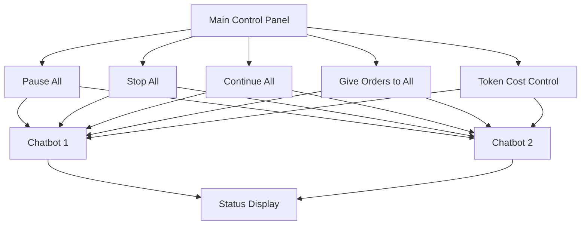

Here is the plan for a GUI that allows users to control multiple AI LLM chatbots in VSCode, including layout and functionality:

### GUI Layout Plan

1. **Main Control Panel:**
   - Buttons for Pause All, Stop All, Continue All, Give Orders to All.
   - Token Cost Control slider/input field.

2. **Individual Chatbot Controls:**
   - Card-like display for each chatbot showing name, status, current intention, current action, next step, and questions (in purple).
   - Buttons for Stop Individual and Give Orders to Individual.

3. **Status Display:**
   - Error Detection Display for showing errors.
   - Activity Log for real-time monitoring.

4. **Interaction Modes:**
   - Drag and drop for reordering chatbots.
   - Click controls for commands.
   - Dropdown menus for saved configurations.

### Implementation Steps

1. Design the Layout: Sketch the layout to ensure it is intuitive.
2. Implement Main Control Panel: Create global command buttons and token cost control.
3. Implement Individual Chatbot Controls: Design chatbot cards with status info and individual command buttons.
4. Implement Status Display: Create sections for error display and activity logging.
5. Implement Interaction Modes: Add drag-and-drop, click controls, and dropdown menus.
6. Error Handling and Display: Implement error detection and display logic.
7. Token Cost Control: Implement token control and display usage/budget.
8. Testing and Iteration: Thoroughly test and iterate based on feedback.